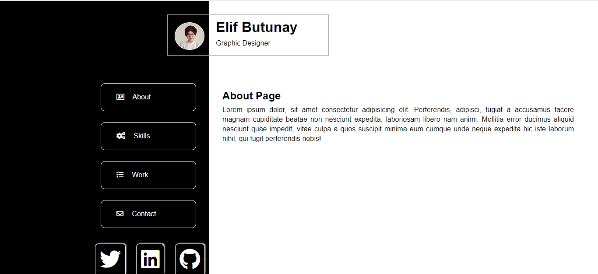

# Freelance Portfolio Project

> This is a freelance portfolio project for a graphic designer.

## Built With

- HTML5
- CSS3
-Javascript

## Live Demo

[Live Demo Link](https://rawcdn.githack.com/nusretbutunay/elifbutunay/e7b8f625686ae9629f14f77866b7a7c6c379308e/index.html)

## Getting Started

To get a local copy of the repository please run the following commands on your terminal:

$ cd <folder>
$ git clone https://github.com/nusretbutunay/elifbutunay.git

## Authors

👤 Nusret Butunay

- Github: [@nusretbutunay](https://github.com/nusretbutunay)
- Linkedin: [@nusretbutunay](https://www.linkedin.com/in/nusretbutunay)
- Twitter: [@nusretbutunay](https://twitter.com/nusretbutunay)

## 🤝 Contributing

Contributions, issues and feature requests are welcome!

Feel free to check [issues page](issues/).

## Show your support

Give a ⭐️ if you like this project!

## Acknowledgments

Thanks to Elif Butunay for giving me opportunity to build her portfolio page.
